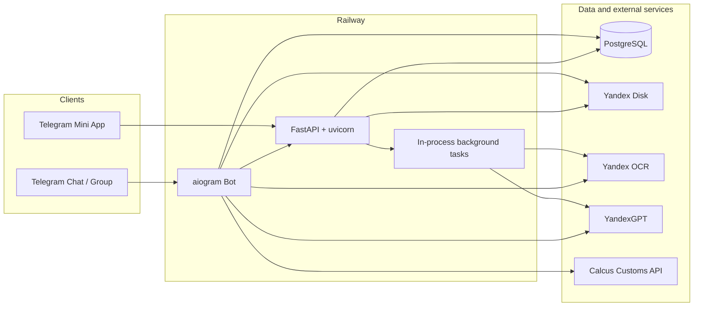

# Auto Export Demo

[Русская версия → README.md](README.md)

Telegram bot and Telegram Mini App for auto-export customer onboarding: document kit upload, OCR, field extraction, Yandex Disk storage, customer creation, specifications, and estimates.

Repository: [github.com/mrKserol/auto_export_demo](https://github.com/mrKserol/auto_export_demo)

---

## 1. About the project

The system accepts a four-document customer kit (passport main page, registration page, SNILS, TIN), runs Yandex OCR, classifies document type and extracts fields with YandexGPT, stores files on Yandex Disk, and lets an employee review and save the customer record.

Two entry paths:

- Telegram commands and buttons (private chat / group);
- Arthur AutoExport Mini App (web UI inside Telegram).

`python -m app.main` starts aiogram polling and FastAPI (uvicorn) in one process.

---

## 2. Features

- Customer onboarding from a document kit (`/add_customer` and Mini App).
- Customer search by passport and card editing.
- Image auto-orientation before OCR: EXIF Orientation plus adaptive 0° / 90° / 180° / 270° fallback.
- Document type detection and field extraction (passport, registration, SNILS, TIN).
- Upload of source files to Yandex Disk under a customer folder.
- Vehicle specification create/edit (Mini App + FSM).
- Estimate creation (Mini App / file upload / step-by-step), Excel template, optional Calcus customs calculation.
- Customer contract generation from a DOCX template.
- Employee allowlist for Mini App APIs.
- Background batch processing and recovery of stuck Mini App batches after restart.
- FastAPI health check: `GET /health`.

---

## 3. Architecture



Customer document flow (simplified):

```text
Upload 4 files
  → OCR (+ auto-orientation for images)
  → type classification
  → field extraction (YandexGPT)
  → kit validation
  → Yandex Disk folder
  → manual review / save customer
```

---

## 4. Operating scenarios

### Telegram: `/add_customer`

1. Employee sends `/add_customer`.
2. Uploads up to four files (photo or document).
3. Starts recognition.
4. Bot runs OCR/classification/extraction and saves files to Disk.
5. Opens review / customer form in Mini App (DM; from a group — deep link).

### Mini App: create customer

1. Open `/miniapp` (only Telegram user IDs on the allowlist).
2. “Add customer” → upload four document slots.
3. “Recognize” → status polling → preview → save form.
4. Then open the card and create a specification if needed.

### Mini App: search customer

1. “Find customer” → passport (10 digits).
2. Card → edit or create specification (if none exists).

### Specification and estimate

- Specification: Mini App form or `/add_specification` (FSM).
- Estimate: from card/specification — Mini App, file upload, or step-by-step input; Calcus optional.

---

## 5. Supported documents

Onboarding kit:

| Type | Purpose |
|---|---|
| `passport_main` | Russian passport main spread |
| `passport_registration` | Registration page |
| `snils` | SNILS |
| `tin` | Individual TIN |

`declared_document_type` in Mini App selects the upload slot and OCR score profile but does **not** override final classification: the OCR text guard sets `detected_document_type`. Mismatches are stored with a warning.

---

## 6. Supported file formats

Customer document upload (Telegram batch / Mini App):

- `jpg`, `jpeg`, `png`, `webp`, `heic` / `heif`, `pdf`

Also in the general document pipeline (not the customer batch kit):

- `docx`, `xlsx` (see `SUPPORTED_EXTENSIONS` in `file_service`)

Templates:

- `templates/customer_contract_template.docx`
- `templates/smeta_template.xlsx`

Default customer file size limit: 20 MB (`CUSTOMER_UPLOAD_MAX_FILE_BYTES`).

---

## 7. Technology stack

| Area | Technology |
|---|---|
| Language | Python 3.11+ |
| Telegram | aiogram 3 |
| HTTP API / Mini App | FastAPI, uvicorn, pydantic |
| Database | PostgreSQL, asyncpg |
| File storage | Yandex Disk REST API |
| OCR | Yandex OCR API |
| LLM | YandexGPT |
| PDF | PyMuPDF |
| Images | Pillow (+ optional pillow-heif for HEIC) |
| Documents | docxtpl, openpyxl |
| Deploy | Railway (`railpack.json`, start: `python -m app.main`) |

---

## 8. Project structure

```text
app/
  main.py                 # entrypoint
  bot.py                  # polling + uvicorn + startup recovery
  config.py               # env settings
  database.py             # PostgreSQL schema (CREATE / ENSURE)
  handlers/               # Telegram commands and callbacks
  repositories/           # batch repository
  services/               # OCR, GPT, Disk, Mini App, estimates, …
  web/                    # FastAPI, auth, Mini App static assets
  states/                 # FSM
templates/                # DOCX / XLSX templates
tests/                    # unittest
railpack.json             # Railway start command
requirements.txt
.env.example
```

---

## 9. Environment variables

Source of truth: `app/config.py` and `.env.example`. Do not commit real secrets.

### Required

| Variable | Purpose |
|---|---|
| `TELEGRAM_BOT_TOKEN` | bot token |
| `DATABASE_URL` | PostgreSQL |
| `YANDEX_DISK_TOKEN` | Disk OAuth token |
| `YANDEX_API_KEY` | OCR / GPT API key |
| `YANDEX_CLOUD_FOLDER_ID` | cloud folder id for GPT |
| `MINI_APP_BASE_URL` | public HTTPS app URL |
| `MINI_APP_TOKEN_SECRET` | launch-token signing secret (**must not** equal bot token) |

### Optional / defaults

| Variable | Default | Purpose |
|---|---|---|
| `YANDEX_DISK_BASE_PATH` | `/auto_export_demo` | Disk root path |
| `YANDEX_FUNCTION_URL` | empty | Cloud Function (required if `ENABLE_PROCESSING=true`) |
| `ENABLE_PROCESSING` | `false` | legacy Function pipeline |
| `OCR_MIN_DELAY_SECONDS` | `1.5` | OCR service parameter |
| `MAX_OCR_RETRIES` | `5` | OCR retries on 429/5xx |
| `WEB_HOST` | `0.0.0.0` | FastAPI bind host |
| `WEB_PORT` / `PORT` | `8000` | port (`PORT` preferred) |
| `MINI_APP_TOKEN_TTL_SECONDS` | `900` | launch token TTL |
| `TELEGRAM_INIT_DATA_MAX_AGE_SECONDS` | `900` | Telegram `initData` TTL |
| `CUSTOMER_UPLOAD_MAX_FILE_BYTES` | `20971520` | customer file size limit |
| `CUSTOMER_BATCH_STALE_PROCESSING_SECONDS` | `600` | stale `recognizing` threshold |
| `TELEGRAM_BOT_USERNAME` | empty | bot username without `@` |
| `MINIAPP_TEST_MODE` | `false` | does **not** open Mini App to everyone; allowlist is not bypassed |
| `MINIAPP_ALLOWED_TELEGRAM_USER_IDS` | empty | CSV of Telegram user ids; **empty = all Mini App APIs return 403** |
| `CALCUS_CLIENT_ID` / `CALCUS_API_KEY` | empty | customs in estimates |
| `CALCUS_CUSTOMS_API_URL` | `https://calcus.ru/api/v1/Customs` | Calcus URL |
| `RAILWAY_GIT_COMMIT_SHA` / `GIT_COMMIT_SHA` | `unknown` | diagnostic SHA |

Allowlist example:

```bash
MINIAPP_ALLOWED_TELEGRAM_USER_IDS=316257868,123456789
```

---

## 10. Local run

```bash
python -m venv .venv
source .venv/bin/activate
pip install -r requirements.txt

cp .env.example .env
# fill secrets and MINIAPP_ALLOWED_TELEGRAM_USER_IDS

set -a
source .env
set +a

python -m app.main
```

Check:

```bash
curl http://127.0.0.1:8000/health
```

Tables are created/extended on DB connect (`CREATE TABLE IF NOT EXISTS` + `ENSURE … COLUMN`).

HEIC ideally needs `pillow-heif` (otherwise HEIC OCR fails with a support error).

---

## 11. Deploy on Railway

1. Create a Railway project and connect the repository.
2. Add PostgreSQL and copy `DATABASE_URL`.
3. Set all required env vars and the employee allowlist.
4. Expose the service HTTP port (`PORT` / `WEB_PORT`) so Telegram can open the Mini App over HTTPS.
5. Start command in `railpack.json`:

```bash
python -m app.main
```

After deploy verify:

- `GET /health`;
- logs: non-empty allowlist; commit SHA;
- `/miniapp` opened from Telegram by an allowlisted user.

---

## 12. Telegram Mini App setup

1. Set `MINI_APP_BASE_URL` to the public HTTPS URL (no trailing `/`).
2. Configure Web App / Menu Button domain in BotFather if needed.
3. Set `TELEGRAM_BOT_USERNAME` and `MINIAPP_ALLOWED_TELEGRAM_USER_IDS`.
4. Main pages:
   - `/miniapp` — home (create / find customer);
   - `/miniapp/customer` — customer / batch form;
   - `/miniapp/specification` — specification;
   - `/miniapp/estimate` — estimate.

In groups, Web App buttons are not attached to the group message: the form is sent to DM or via a deep link `/start …` with a one-time code in `mini_app_launch_codes` (Telegram deep-link payload limit is 64 characters).

HTML shells are public; **data and APIs** require valid `initData` and allowlist membership.

---

## 13. Security

- Validates Telegram `initData` signature, `auth_date`, and `telegram_user_id`.
- Mini App APIs: only users listed in `MINIAPP_ALLOWED_TELEGRAM_USER_IDS`.
- Empty allowlist with `MINIAPP_TEST_MODE=false` locks Mini App APIs (ERROR logged at startup).
- `MINIAPP_TEST_MODE=true` does **not** mean “allow everyone”.
- Launch tokens are signed; include purpose / exp / user id; no PII inside the token.
- Batch APIs enforce batch owner (`telegram_user_id`).
- Mini App customer access model: any allowlisted employee may search any customer (no multi-tenant isolation).
- Mini App rate limit is in-memory (single replica).
- Orientation logs must not include OCR text or personal data.

---

## 14. Testing

```bash
python -m unittest discover -s tests -v
```

Some integration tests need PostgreSQL (`TEST_DATABASE_URL` or `testing.postgresql`).

Coverage includes initData, tokens, batch upload/recognition, Mini App ACL, stale-batch recovery, OCR auto-orientation, specifications, and estimates.

---

## 15. Limitations

- Recognition is **not 100% accurate**; manual review and correction are required.
- Auto-orientation does not fix strong perspective skew, cropping, glare, blur, or very small text.
- PDF: multi-angle rotation search is **not** implemented in the MVP (pages are rendered and OCR’d without 90/180/270 search).
- Background OCR tasks are **in-process** (`asyncio` tasks): container restart drops the task; recovery moves stale `recognizing` batches back to `collecting` for retry (`CUSTOMER_BATCH_STALE_PROCESSING_SECONDS`).
- No separate queue (Celery/Redis) and no multi-replica coordination for rate limits / background tasks.
- OCR `min_delay_seconds` is configured on the service; an explicit pause between successful requests is not currently enforced (retry backoff and a global OCR lock exist).
- Calcus works only when `CALCUS_*` is configured.
- HEIC requires `pillow-heif`.
- No LICENSE file is published in the repository.

---

## 16. Project status

Working MVP / staging-ready for a closed employee circle (allowlist).

Actively used: Telegram bot, Mini App, OCR, GPT, Yandex Disk, specifications, estimates, batch recovery, employee allowlist.

Do not treat as production-ready without a populated allowlist, stuck-batch monitoring, and an explicit customer-data access model.

---

## 17. License

No license file is published in the repository. Use is governed by the repository owner unless stated otherwise.
