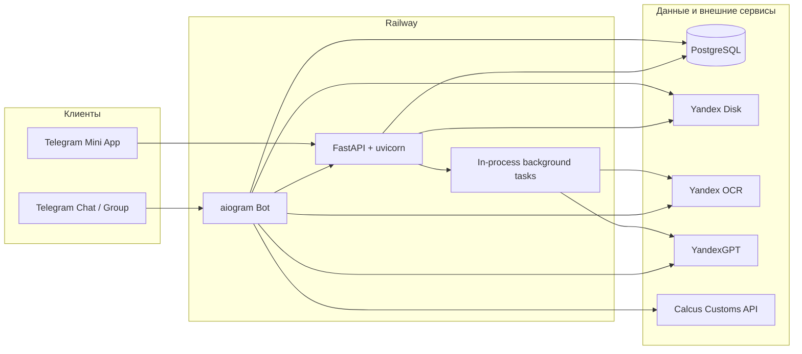

# Auto Export Demo

**License:** All Rights Reserved © 2026 Almaz Sadykov · [LICENSE](LICENSE)

[English version → README.en.md](README.en.md)

Telegram-бот и Telegram Mini App для онбординга клиентов автоэкспорта: загрузка комплекта документов, OCR, извлечение полей, сохранение на Яндекс Диск, создание клиента, спецификации и сметы.

Репозиторий: [github.com/mrKserol/auto_export_demo](https://github.com/mrKserol/auto_export_demo)

---

## 1. О проекте

Система принимает комплект из четырёх документов клиента (главная страница паспорта, страница регистрации, СНИЛС, ИНН), распознаёт текст через Yandex OCR, классифицирует тип документа и извлекает поля через YandexGPT, сохраняет файлы на Яндекс Диск и позволяет сотруднику проверить и сохранить карточку клиента.

Работа доступна двумя путями:

- команды и кнопки в Telegram (чат / группа);
- Arthur AutoExport Mini App (веб-интерфейс внутри Telegram).

Процесс `python -m app.main` одновременно запускает aiogram polling и FastAPI (uvicorn).

---

## 2. Возможности

- Добавление клиента по комплекту документов (`/add_customer` и Mini App).
- Поиск клиента по паспорту и редактирование карточки.
- Автоориентация изображений перед OCR: EXIF Orientation + адаптивный перебор углов 0° / 90° / 180° / 270°.
- Определение типа документа и извлечение полей (паспорт, прописка, СНИЛС, ИНН).
- Загрузка исходных файлов на Яндекс Диск в папку клиента.
- Создание и редактирование спецификации автомобиля (Mini App + FSM).
- Создание сметы (Mini App / загрузка / пошаговый ввод), Excel-шаблон, опциональный расчёт таможни через Calcus.
- Генерация договора клиента из DOCX-шаблона.
- Allowlist сотрудников для Mini App API.
- Фоновая обработка batch и восстановление «зависших» Mini App batch после рестарта.
- Health-check FastAPI: `GET /health`.

---

## 3. Архитектура



Поток документов клиента (упрощённо):

```text
Загрузка 4 файлов
  → OCR (+ автоориентация для изображений)
  → классификация типа
  → извлечение полей (YandexGPT)
  → проверка комплекта
  → папка на Яндекс Диске
  → ручная проверка / сохранение клиента
```

---

## 4. Сценарий работы

### Telegram: `/add_customer`

1. Сотрудник отправляет `/add_customer`.
2. Загружает до четырёх файлов (фото или документ).
3. Нажимает распознавание.
4. Бот выполняет OCR/классификацию/извлечение, сохраняет файлы на Диск.
5. Открывается форма проверки / карточка клиента в Mini App (в ЛС; из группы — deep link).

### Mini App: создание клиента

1. Открыть `/miniapp` (доступ только для Telegram user id из allowlist).
2. «Добавить клиента» → загрузить 4 слота документов.
3. «Распознать» → polling статуса → превью → форма сохранения.
4. Далее можно открыть карточку и создать спецификацию.

### Mini App: поиск клиента

1. «Найти клиента» → ввод паспорта (10 цифр).
2. Карточка → редактирование или создание спецификации (если ещё нет).

### Спецификация и смета

- Спецификация: Mini App-форма или `/add_specification` (FSM).
- Смета: из карточки / спецификации — Mini App, загрузка файла или пошаговый ввод; опционально Calcus.

---

## 5. Поддерживаемые документы

Комплект для онбординга клиента:

| Тип | Назначение |
|---|---|
| `passport_main` | Главная страница / разворот паспорта РФ |
| `passport_registration` | Страница регистрации |
| `snils` | СНИЛС |
| `tin` | ИНН физлица |

`declared_document_type` в Mini App задаёт слот и OCR score-профиль, но **не** подменяет итоговую классификацию: guard по OCR-тексту определяет `detected_document_type`. При несовпадении результат сохраняется с предупреждением.

---

## 6. Поддерживаемые форматы файлов

Для загрузки документов клиента (Telegram batch / Mini App):

- `jpg`, `jpeg`, `png`, `webp`, `heic` / `heif`, `pdf`

Дополнительно в общем document pipeline (не клиентский batch):

- `docx`, `xlsx` (см. `SUPPORTED_EXTENSIONS` в `file_service`)

Шаблоны:

- `templates/customer_contract_template.docx`
- `templates/smeta_template.xlsx`

Лимит размера файла клиента (по умолчанию): 20 МБ (`CUSTOMER_UPLOAD_MAX_FILE_BYTES`).

---

## 7. Стек технологий

| Компонент | Технология |
|---|---|
| Язык | Python 3.11+ |
| Telegram | aiogram 3 |
| HTTP API / Mini App | FastAPI, uvicorn, pydantic |
| БД | PostgreSQL, asyncpg |
| Хранение файлов | Yandex Disk REST API |
| OCR | Yandex OCR API |
| LLM | YandexGPT |
| PDF | PyMuPDF |
| Изображения | Pillow (+ опционально pillow-heif для HEIC) |
| Документы | docxtpl, openpyxl |
| Deploy | Railway (`railpack.json`, start: `python -m app.main`) |

---

## 8. Структура проекта

```text
app/
  main.py                 # точка входа
  bot.py                  # polling + uvicorn + startup recovery
  config.py               # настройки из env
  database.py             # схема PostgreSQL (CREATE / ENSURE)
  handlers/               # команды и callback Telegram
  repositories/           # batch-репозиторий
  services/               # OCR, GPT, Disk, Mini App, сметы, …
  web/                    # FastAPI, auth, static Mini App
  states/                 # FSM
templates/                # DOCX / XLSX шаблоны
tests/                    # unittest
railpack.json             # Railway start command
requirements.txt
.env.example
```

---

## 9. Переменные окружения

Источник истины: `app/config.py` и `.env.example`. Секреты в git не коммитить.

### Обязательные

| Переменная | Назначение |
|---|---|
| `TELEGRAM_BOT_TOKEN` | токен бота |
| `DATABASE_URL` | PostgreSQL |
| `YANDEX_DISK_TOKEN` | OAuth-токен Диска |
| `YANDEX_API_KEY` | ключ для OCR / GPT |
| `YANDEX_CLOUD_FOLDER_ID` | folder id облака для GPT |
| `MINI_APP_BASE_URL` | публичный HTTPS URL приложения |
| `MINI_APP_TOKEN_SECRET` | секрет подписи launch-токенов (**не** равен bot token) |

### Опциональные / со значениями по умолчанию

| Переменная | По умолчанию | Назначение |
|---|---|---|
| `YANDEX_DISK_BASE_PATH` | `/auto_export_demo` | корневая папка на Диске |
| `YANDEX_FUNCTION_URL` | пусто | Cloud Function (если `ENABLE_PROCESSING=true` — обязателен) |
| `ENABLE_PROCESSING` | `false` | legacy-пайплайн через Function |
| `OCR_MIN_DELAY_SECONDS` | `1.5` | параметр OCR-сервиса |
| `MAX_OCR_RETRIES` | `5` | ретраи OCR при 429/5xx |
| `WEB_HOST` | `0.0.0.0` | bind FastAPI |
| `WEB_PORT` / `PORT` | `8000` | порт (`PORT` имеет приоритет) |
| `MINI_APP_TOKEN_TTL_SECONDS` | `900` | TTL launch-токена |
| `TELEGRAM_INIT_DATA_MAX_AGE_SECONDS` | `900` | TTL Telegram `initData` |
| `CUSTOMER_UPLOAD_MAX_FILE_BYTES` | `20971520` | лимит файла клиента |
| `CUSTOMER_BATCH_STALE_PROCESSING_SECONDS` | `600` | порог «зависшего» recognizing |
| `TELEGRAM_BOT_USERNAME` | пусто | username бота без `@` |
| `MINIAPP_TEST_MODE` | `false` | **не** открывает Mini App всем; allowlist не обходится |
| `MINIAPP_ALLOWED_TELEGRAM_USER_IDS` | пусто | CSV Telegram user id; **пустой = все Mini App API 403** |
| `CALCUS_CLIENT_ID` / `CALCUS_API_KEY` | пусто | таможня в сметах |
| `CALCUS_CUSTOMS_API_URL` | `https://calcus.ru/api/v1/Customs` | URL Calcus |
| `RAILWAY_GIT_COMMIT_SHA` / `GIT_COMMIT_SHA` | `unknown` | диагностический SHA |

Пример allowlist:

```bash
MINIAPP_ALLOWED_TELEGRAM_USER_IDS=316257868,123456789
```

---

## 10. Локальный запуск

```bash
python -m venv .venv
source .venv/bin/activate
pip install -r requirements.txt

cp .env.example .env
# заполнить секреты и MINIAPP_ALLOWED_TELEGRAM_USER_IDS

set -a
source .env
set +a

python -m app.main
```

Проверка:

```bash
curl http://127.0.0.1:8000/health
```

Таблицы создаются/дополняются при подключении к БД (`CREATE TABLE IF NOT EXISTS` + `ENSURE … COLUMN`).

Для HEIC желателен пакет `pillow-heif` (если не установлен — HEIC OCR вернёт ошибку поддержки).

---

## 11. Deploy на Railway

1. Создать проект Railway и подключить репозиторий.
2. Добавить PostgreSQL, скопировать `DATABASE_URL`.
3. Задать все обязательные env и allowlist сотрудников.
4. Открыть HTTP-порт сервиса (`PORT` / `WEB_PORT`), чтобы Telegram открывал Mini App по HTTPS.
5. Старт задаётся в `railpack.json`:

```bash
python -m app.main
```

После деплоя проверить:

- `GET /health`;
- логи: allowlist не пустой; commit SHA;
- открытие `/miniapp` из Telegram под allowlisted user.

---

## 12. Настройка Telegram Mini App

1. `MINI_APP_BASE_URL` = публичный HTTPS URL (без завершающего `/`).
2. В BotFather указать домен Web App / Menu Button при необходимости.
3. Заполнить `TELEGRAM_BOT_USERNAME` и `MINIAPP_ALLOWED_TELEGRAM_USER_IDS`.
4. Основные страницы:
   - `/miniapp` — главная (создать / найти клиента);
   - `/miniapp/customer` — форма клиента / batch;
   - `/miniapp/specification` — спецификация;
   - `/miniapp/estimate` — смета.

Из группы Web App-кнопка в чат группы не ставится: форма уходит в ЛС или через deep link ` /start … ` с одноразовым кодом в `mini_app_launch_codes` (лимит Telegram deep-link payload — 64 символа).

HTML-оболочки публичны; **данные и API** требуют валидный `initData` и membership в allowlist.

---

## 13. Безопасность

- Проверка подписи Telegram `initData`, `auth_date`, `telegram_user_id`.
- Mini App write/read API: только пользователи из `MINIAPP_ALLOWED_TELEGRAM_USER_IDS`.
- Пустой allowlist при `MINIAPP_TEST_MODE=false` блокирует Mini App API (ERROR в логах при старте).
- `MINIAPP_TEST_MODE=true` **не** означает «разрешить всем».
- Launch-токены подписаны секретом, содержат purpose / exp / user id; без PII в токене.
- Batch API проверяет владельца batch (`telegram_user_id`).
- Модель доступа к клиентам в Mini App: любой сотрудник из allowlist может искать любого клиента (multi-tenant изоляции нет).
- Rate limit Mini App — in-memory (на одну реплику).
- Не логировать OCR-текст и персональные данные в orientation-логах.

---

## 14. Тестирование

```bash
python -m unittest discover -s tests -v
```

Часть интеграционных тестов требует PostgreSQL (`TEST_DATABASE_URL` или `testing.postgresql`).

Покрываются, в том числе: initData, токены, batch upload/recognition, Mini App ACL, recovery stale batch, автоориентация OCR, спецификации и сметы.

---

## 15. Ограничения

- Распознавание **не гарантирует 100%** точность; нужны ручная проверка и коррекция.
- Автоориентация не исправляет сильную перспективу, обрезку, блики, размытие, слишком мелкий текст.
- PDF: multi-angle rotation search в MVP **не** выполняется (страницы рендерятся и OCR’ятся без перебора 90/180/270).
- Фоновые OCR-задачи — **in-process** (`asyncio` tasks): при рестарте контейнера задача теряется; recovery возвращает stale `recognizing` в `collecting` для повторного запуска (порог `CUSTOMER_BATCH_STALE_PROCESSING_SECONDS`).
- Нет отдельной очереди (Celery/Redis) и нет multi-replica координации rate limit / background tasks.
- `min_delay_seconds` OCR передаётся в сервис; между успешными запросами явная пауза в текущем коде не enforced (есть retry backoff и глобальный OCR lock).
- Calcus работает только при настроенных `CALCUS_*`.
- HEIC требует `pillow-heif`.

---

## 16. Статус проекта

Рабочий MVP / staging-ready для закрытого круга сотрудников (allowlist).

Активно используются: Telegram bot, Mini App, OCR, GPT, Яндекс Диск, спецификации, сметы, batch recovery, employee allowlist.

Не считать production-ready без: заполненного allowlist, мониторинга зависших batch, осознанной модели доступа к клиентским данным.

---

## 17. Лицензия

Проект распространяется по лицензии **All Rights Reserved**.

Все права защищены. Copyright (c) 2026 Almaz Sadykov.

Любое использование, копирование, изменение, распространение, публикация, создание производных работ или коммерческое использование допускается только с предварительного письменного разрешения правообладателя.

Подробнее см. файл [LICENSE](LICENSE).
